# Nicotine Withdrawal in Alzheimer’s Disease

``` r
nicotine <- read.csv("nicotine.csv")

nicotine <- nicotine %>%
  column_to_rownames(var = "id") %>%
  separate(col = "group", into = c("Treatment", "Withdrawal"), remove = FALSE) %>%
  mutate(Withdrawal = ifelse(is.na(Withdrawal), "CTR", Withdrawal))
```

``` r
epm_p <- ggplot(nicotine, aes(x = group, y = EPM, colour = group)) +
  geom_boxplot() +
  geom_point(size = 1) +
  labs(y = "Open/Close Ratio", colour = "Group") +
  theme_classic() +
  theme(axis.title.x = element_blank(), axis.text.x = element_blank())

mwm_p <- ggplot(nicotine, aes(x = group, y = MWM, colour = group)) +
  geom_boxplot() +
  geom_point(size = 1) +
  labs(y = "Latency (s)", colour = "Group") +
  theme_classic() +
  theme(axis.title.x = element_blank(), axis.text.x = element_blank())

pasta_p <- ggplot(nicotine, aes(x = group, y = PASTA, colour = group)) +
  geom_boxplot() +
  geom_point(size = 1) +
  labs(y = "AUC Startle (g)", colour = "Group") +
  theme_classic() +
  theme(axis.title.x = element_blank(), axis.text.x = element_blank())
```

``` r
of_df <- nicotine %>%
  pivot_longer(cols = c("OF1", "OF2", "OF3", "OF4"),
               names_to = "Time", values_to = "OF") %>%
    mutate(Time = 2 * (as.numeric(gsub("OF", "", Time)) - 1))

nor_df <- nicotine %>%
  pivot_longer(cols = c("NOR1", "NOR2", "NOR3", "NOR4"),
               names_to = "Time", values_to = "NOR") %>%
  mutate(Time = 2 * (as.numeric(gsub("NOR", "", Time)) - 1))
```

``` r
of_p <- ggplot(of_df, aes(x = Time, y = OF, group = group, colour = group)) +
  geom_smooth() +
  geom_jitter(width = 0.2, size = 1) +
  lims(y = c(0, 0.5)) +
  labs(y = "Center Time (%)") +
  theme_classic() +
  theme(axis.title.x = element_blank(), axis.text.x = element_blank(),
        legend.position = "none")

nor_p <- ggplot(nor_df, aes(x = Time, y = NOR, group = group, colour = group)) +
  geom_smooth() +
  geom_jitter(width = 0.2, size = 1) +
  geom_hline(yintercept = 0.5, linetype = "dashed", colour = "red") +
  lims(y = c(0, 1)) +
  labs(x = "Time (weeks)", y = "Novel Object Exploration (%)") +
  theme_classic() +
  theme(legend.position = "none")
```

``` r
((of_p / nor_p) | (epm_p / mwm_p / pasta_p)) +
  plot_layout(guides = "collect") +
  plot_annotation(tag_levels = "A")
```

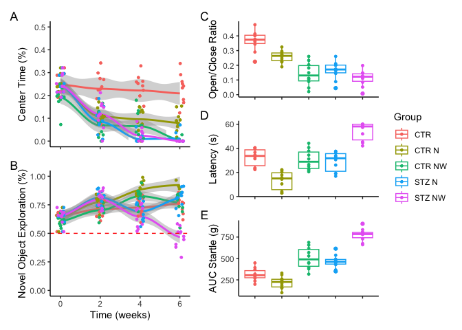

``` r
nor_fit <- lm(NOR ~ group + Time + group * Time, data = nor_df)
summary(nor_fit)
```


    Call:
    lm(formula = NOR ~ group + Time + group * Time, data = nor_df)

    Residuals:
         Min       1Q   Median       3Q      Max 
    -0.26870 -0.05372  0.00505  0.05036  0.22170 

    Coefficients:
                       Estimate Std. Error t value Pr(>|t|)    
    (Intercept)       0.6603649  0.0231484  28.527  < 2e-16 ***
    groupCTR N       -0.0103758  0.0327368  -0.317  0.75163    
    groupCTR NW      -0.0268455  0.0327368  -0.820  0.41322    
    groupSTZ N        0.0275923  0.0327368   0.843  0.40037    
    groupSTZ NW       0.0851941  0.0327368   2.602  0.00999 ** 
    Time              0.0174252  0.0061867   2.817  0.00537 ** 
    groupCTR N:Time   0.0421187  0.0087493   4.814 3.01e-06 ***
    groupCTR NW:Time  0.0132585  0.0087493   1.515  0.13134    
    groupSTZ N:Time   0.0004494  0.0087493   0.051  0.95909    
    groupSTZ NW:Time -0.0524796  0.0087493  -5.998 9.89e-09 ***
    ---
    Signif. codes:  0 '***' 0.001 '**' 0.01 '*' 0.05 '.' 0.1 ' ' 1

    Residual standard error: 0.08749 on 190 degrees of freedom
    Multiple R-squared:  0.5785,    Adjusted R-squared:  0.5585 
    F-statistic: 28.97 on 9 and 190 DF,  p-value: < 2.2e-16

``` r
plot(nor_fit)
```

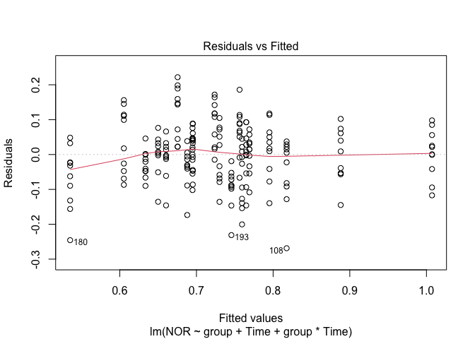

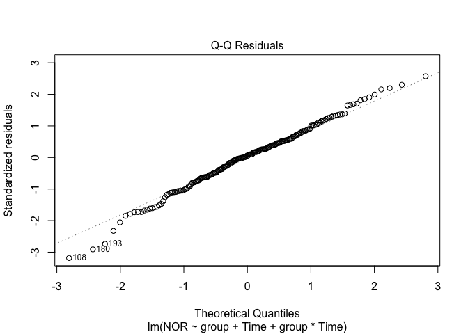

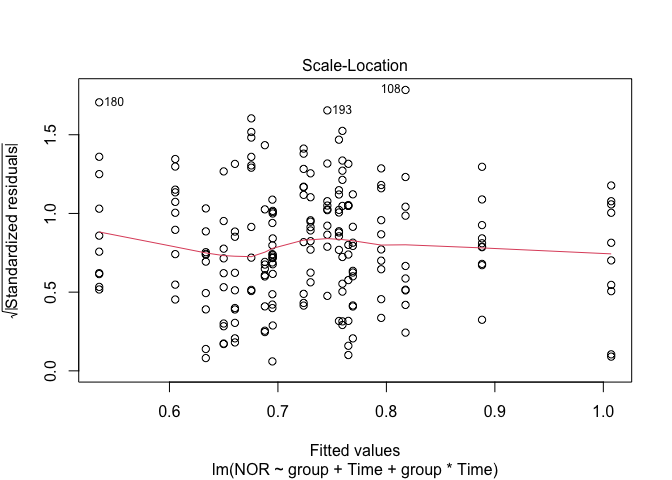

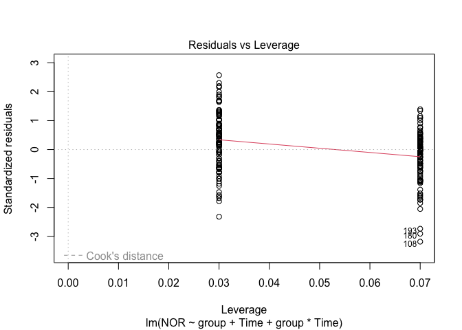

``` r
nor_emmeans <- emmeans(nor_fit, specs = pairwise ~ group | Time, adjust = "fdr")

tmp_df1 <- nor_emmeans$emmeans %>%
  as.data.frame()

tmp_df2 <- nor_emmeans$contrasts %>%
  summary(infer = TRUE) %>%
  as.data.frame()
```

``` r
nor_p1 <- ggplot(subset(tmp_df1, Time == 3),
       aes(x = group, y = emmean, fill = group)) +
  geom_bar(stat = "identity") +
  geom_errorbar(aes(ymin = lower.CL, ymax = upper.CL), width = 0.4) +
  labs(y = "Mean Margin", fill = "Group") +
  theme_classic() +
  theme(axis.title.x = element_blank(),
        axis.text.x = element_text(angle = 45, hjust = 1))

nor_p2 <- ggplot(subset(tmp_df2, Time == 3), aes(x = estimate, y = contrast)) +
  geom_point() +
  geom_errorbarh(aes(xmin = lower.CL, xmax = upper.CL), height = 0.4) +
  geom_vline(xintercept = 0, linetype = "dashed", colour = "red") +
  xlim(x = c(-0.3, 0.3)) +
  geom_text(aes(label = paste("P =", round(p.value, 3))), x = 0.3) +
  theme_classic()

(nor_p1 / nor_p2) +
  plot_annotation(tag_levels = "A")
```

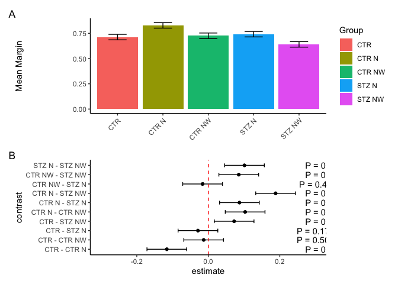

``` r
mwm_fit <- lm(MWM ~ group + OF4, data = nicotine)
summary(mwm_fit)
```


    Call:
    lm(formula = MWM ~ group + OF4, data = nicotine)

    Residuals:
        Min      1Q  Median      3Q     Max 
    -12.024  -6.876   1.476   5.915  13.954 

    Coefficients:
                Estimate Std. Error t value Pr(>|t|)    
    (Intercept)   22.371      5.237   4.272 0.000102 ***
    groupCTR N   -12.989      4.423  -2.936 0.005263 ** 
    groupCTR NW    7.874      5.661   1.391 0.171224    
    groupSTZ N     6.046      5.539   1.092 0.280970    
    groupSTZ NW   31.649      5.746   5.508 1.78e-06 ***
    OF4           48.453     22.343   2.169 0.035560 *  
    ---
    Signif. codes:  0 '***' 0.001 '**' 0.01 '*' 0.05 '.' 0.1 ' ' 1

    Residual standard error: 7.482 on 44 degrees of freedom
    Multiple R-squared:  0.7803,    Adjusted R-squared:  0.7553 
    F-statistic: 31.25 on 5 and 44 DF,  p-value: 1.968e-13

``` r
plot(mwm_fit)
```

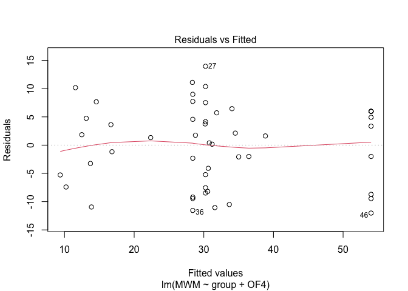

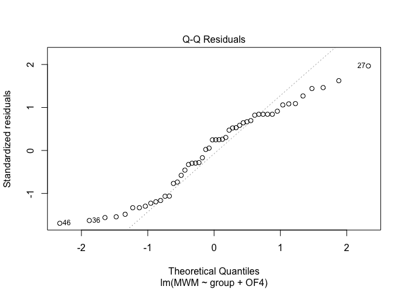

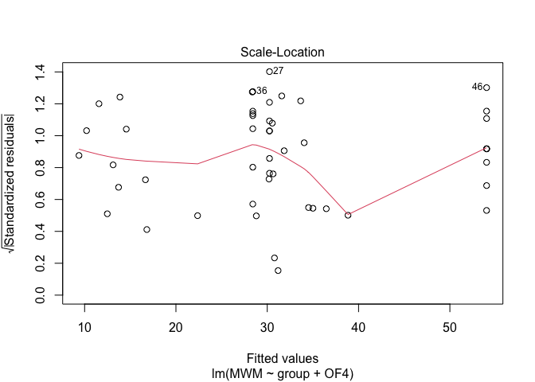

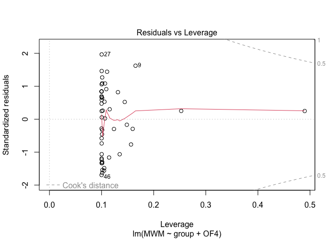

``` r
mwm_emmeans <- emmeans(mwm_fit, specs = pairwise ~ group, adjust = "fdr")

tmp_df1 <- mwm_emmeans$emmeans %>%
  as.data.frame()

tmp_df2 <- mwm_emmeans$contrasts %>%
  summary(infer = TRUE) %>%
  as.data.frame()
```

``` r
mwm_p1 <- ggplot(tmp_df1, aes(x = group, y = emmean, fill = group)) +
  geom_bar(stat = "identity") +
  geom_errorbar(aes(ymin = lower.CL, ymax = upper.CL), width = 0.4) +
  labs(y = "Mean Margin", fill = "Group") +
  theme_classic() +
  theme(axis.title.x = element_blank(),
        axis.text.x = element_text(angle = 45, hjust = 1))

mwm_p2 <- ggplot(tmp_df2, aes(x = estimate, y = contrast)) +
  geom_point() +
  geom_errorbarh(aes(xmin = lower.CL, xmax = upper.CL), height = 0.4) +
  geom_vline(xintercept = 0, linetype = "dashed", colour = "red") +
  xlim(x = c(-60, 40)) +
  geom_text(aes(label = paste("P =", round(p.value, 3))), x = 40) +
  theme_classic()

(mwm_p1 / mwm_p2) +
  plot_annotation(tag_levels = "A")
```

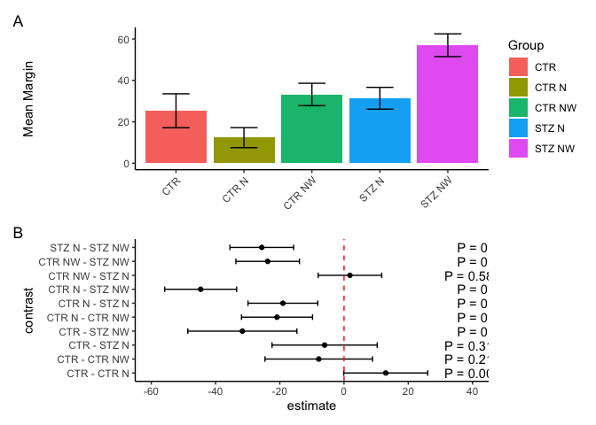
